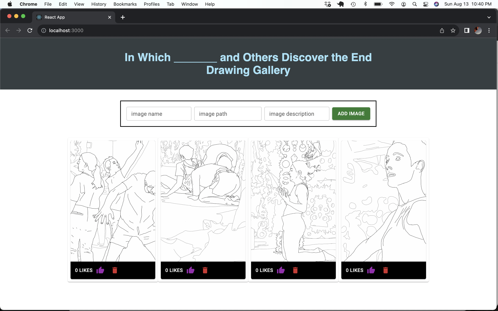

# Image Gallery

## Description

_Duration: Weekend Challenge_

This app is an image gallery created to display images in a grid pattern.

## Screen Shot

Screen shot of the gallery with several images added:

### Prerequisites

- [Node.js](https://nodejs.org/en/)

## Installation

1. Create a database named `react_gallery`,
2. The queries in the `database.sql` file are set up to create all the necessary tables and populate the needed data to allow the application to run correctly. The project is built on [Postgres](https://www.postgresql.org/download/), so you will need to make sure to have that installed. We recommend using Postico to run those queries as that was used to create the queries, 
3. Open up your editor of choice and run an `npm install`
4. Run `npm run server` in your terminal
5. In another terminal run `npm run client` 
6. The `npm run client` command will open up a new browser tab for you!

## Usage
How does someone use this application? Tell a user story here.

1. Users can add new images to the gallery with image name, path, and description. These images will appear in the browser and are added to the database. (Currently images can only be with direct url pathways.)
2. Once images are added users can click on the image and the image description will appear.
3. Beneath each image is a 'like' counter and a button to add likes.
4. Next to the like button is a delete button, which removes the image from botht the browser and the database.

## Built With

- Javascript
- React
- Node.js
- Express 
- Material UI
- Postgresql

## Acknowledgement
Thanks to [Prime Digital Academy](www.primeacademy.io) who equipped and helped me to make this application a reality. 
